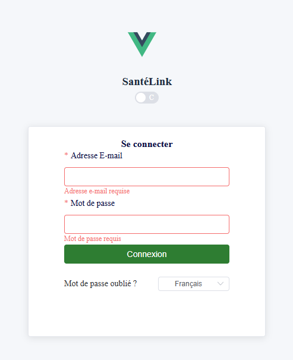

# SanteLinkWeb V0.0.1

## Capture d’écran



Astuce: placez votre capture dans `SanteLinkWeb/public/screenshots/login.png` pour qu’elle s’affiche ci‑dessus.

## Capture d’écran — Tableau de bord


Placez le fichier ici: `SanteLinkWeb/public/screenshots/dashboard.png`.


## Déploiement (Vite + Vue 3 + Element Plus)

1. Prérequis
   - Node.js LTS (>= 18)
   - Yarn ou npm
   - URL d’API disponible (variable `VITE_APP_API_BASE`)

2. Configuration des variables d’environnement
   - Créez un fichier `.env` à la racine de `SanteLinkWeb/` si nécessaire.
   - Exemples:
     ```env
     VITE_APP_API_BASE=https://api.example.com
     VITE_APP_VITE_BASE_PATH=/
     ```

3. Installation
   ```bash
   # à la racine de SanteLinkWeb
   yarn install
   # ou
   npm install
   ```

4. Lancement en développement
   ```bash
   yarn dev
   # ou
   npm run dev
   ```
   - L’application démarre par défaut sur `http://localhost:5001` (configuré dans `vite.config.ts`).

5. Build de production
   ```bash
   yarn build
   # ou
   npm run build
   ```
   - Les artefacts de build sont générés dans `dist/`.

6. Prévisualisation locale du build
   ```bash
   yarn preview
   # ou
   npm run preview
   ```

7. Déploiement
   - Servez le contenu du dossier `dist/` via un serveur HTTP (Nginx, Apache, etc.).
   - Exemple de bloc Nginx minimal:
     ```nginx
     server {
       listen 80;
       server_name sante.example.com;
       root /var/www/santelink/dist;
       index index.html;

       location / {
         try_files $uri $uri/ /index.html;
       }

       # Proxy API si nécessaire
       location /api/ {
         proxy_pass https://api.example.com/;
         proxy_set_header Host $host;
         proxy_set_header X-Real-IP $remote_addr;
       }
     }
     ```

## Authentification et Token (JWT)

- Le token est stocké côté client via `localStorage` avec la clé `AUTH_TOKEN` (`src/utils/auth.ts`).
- À chaque requête, un intercepteur Axios ajoute l’en-tête HTTP:
  ```http
  Authorization: Bearer <token>
  ```
- En cas de `401 Unauthorized`, le token est supprimé et l’utilisateur est redirigé vers `/login` (`src/utils/axiosReq.ts`).

### Représentation du Token (JWT)

Un JWT est constitué de trois parties encodées en Base64URL, séparées par des points:

```
<Header>.<Payload>.<Signature>
```

- Header (exemple):
  ```json
  {
    "alg": "HS256",
    "typ": "JWT"
  }
  ```
- Payload (exemple minimal):
  ```json
  {
    "sub": "user_id",
    "name": "John Doe",
    "roles": ["admin"],
    "iat": 1716239022,
    "exp": 1716242622
  }
  ```
- Signature:
  ```
  HMACSHA256(
    base64UrlEncode(header) + "." + base64UrlEncode(payload),
    secret
  )
  ```

### Schéma Mermaid: Token Representation


## Thème et Langue

- Thème clair/sombre via attribut `data-theme` et variables CSS (`src/styles/index.scss`).
- Sélecteur de langue (fr/en) avec persistance (`localStorage`) et i18n léger (`src/i18n/`).

## Scripts utiles

- `dev`: démarrer le serveur de dev
- `build`: build de prod
- `preview`: prévisualiser le build

## Arborescence pertinente

- `src/views/login/Login.vue`: formulaire de connexion
- `src/utils/axiosReq.ts`: configuration Axios + auth header
- `src/utils/auth.ts`: gestion du token localStorage
- `src/i18n/`: i18n léger
- `vite.config.ts`: config Vite (aliases, CSS, port)
